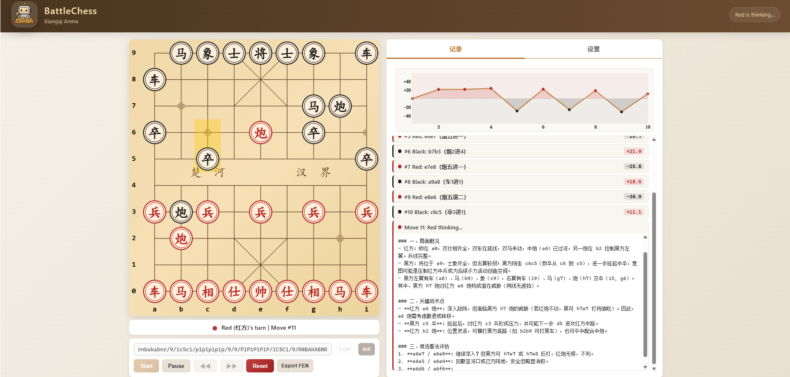

<p align="center">
  
</p>

# BattleChess - Xiangqi Arena

BattleChess 是一个本地运行的中国象棋 Arena，支持 `Human / Random / LLM / Pikafish` 任意两两对局。

前端使用原生 HTML / CSS / JavaScript 与 Canvas，后端使用 FastAPI。LLM 调用统一走 OpenAI Python SDK。

## 界面预览



## 功能概览

- 支持 `Human / Random / LLM / Pikafish` 四种玩家类型
- 支持 Pikafish 直接作为红方或黑方参与对局
- 支持为每一方单独指定不同的 Pikafish 可执行文件
- 支持评估用 Pikafish 与参与方 Pikafish 分开配置
- 支持预设模型和自定义 LLM 配置
- 支持从 `prompts/*.yaml` 加载 Prompt，并在 UI 中选择
- 支持自定义开局 FEN
- 支持暂停、恢复、历史回看，以及从回看位置继续对局
- 支持对局结束后自动保存详细日志
- 支持专业引擎对局评分

## 运行环境

- Python 3.10+

安装依赖：

```bash
pip install -r requirements.txt
```

启动服务：

```bash
python server.py
```

默认访问地址：

```text
http://127.0.0.1:8000
```

## config.yaml

先复制配置模板：

```bash
copy config.example.yaml config.yaml
```

示例：

```yaml
pikafish:
  eval_engine_path: .\pikafish\pikafish-bmi2.exe

models:
  - name: gpt-4o
    api_base: https://api.openai.com/v1
    api_key: sk-xxxxxxxxxxxxxxxx
    model: gpt-4o
    prompt_name: zh
    enable_thinking: true
    max_completion_tokens: 8192
```

字段说明：

- `pikafish.eval_engine_path`：评估区默认使用的 Pikafish 路径。只影响“引擎分析/评估”，不影响参与方玩家。
- `models[].api_base`：传给 OpenAI SDK 的 `base_url`
- `models[].api_key`：模型服务商提供的密钥
- `models[].model`：具体模型名
- `models[].prompt_name`：对应 `prompts/` 目录中的 Prompt 文件名
- `models[].enable_thinking`：是否启用思考模式
- `models[].max_completion_tokens`：单次生成的最大 token 数

## Pikafish 配置说明

### 1. 参与方 Pikafish

在右侧 `Settings` 页里：

1. 把红方或黑方的 `Player Type` 设为 `Pikafish`
2. 填写该方的 `Pikafish Path`
3. 选择该方的 `Mode`
4. 根据模式填写 `Think Time (ms)` 或 `Depth`

说明：

- 玩家用 Pikafish 和评估用 Pikafish 是两套独立配置，互不影响。
- 玩家默认路径由后端提供，默认指向仓库内的 `pikafish-bmi2.exe`。
- 如果当前项目路径是 `C:\Users\25812\Desktop\各类工具\XiangqiArena`，那么默认玩家路径就是：

```text
C:\Users\25812\Desktop\各类工具\XiangqiArena\pikafish\pikafish-bmi2.exe
```

- 如果你在输入框里填的是 `pikafish` 目录，程序会自动补成该目录下的 `pikafish-bmi2.exe`。
- 如果你想使用别的版本，例如 `pikafish-avx2.exe`、`pikafish-avx512.exe`，请直接填对应 exe 的完整路径。

### 2. 评估用 Pikafish

评估引擎的修改位置有两处：

- 当前对局临时修改：右侧 `Pikafish (引擎分析)` 区域中的 `Engine Path`
- 全局默认修改：`config.yaml` 里的 `pikafish.eval_engine_path`

评估引擎的路径解析优先级：

1. 当前页面 `Pikafish (引擎分析)` 的 `Engine Path`
2. `config.yaml -> pikafish.eval_engine_path`
3. 内置默认值 `.\pikafish\pikafish-bmi2.exe`

这意味着：

- 你可以让参与方使用一个 Pikafish，可同时让评估区使用另一个 Pikafish。
- 暂停后再继续对局时，评估引擎会按当前配置重新启动。

## Prompt 文件

Prompt 不再写死在代码里，而是放在 `prompts/*.yaml` 中。

当前内置：

- `prompts/zh.yaml`
- `prompts/en.yaml`

每个 Prompt 文件包含这些字段：

- `system_prompt`
- `turn_prompt`
- `tool_retry_prompt`
- `empty_legal_moves_text`

你可以通过两种方式选择 Prompt：

- 在 `config.yaml` 里为某个预设模型设置 `prompt_name`
- 在页面设置里为某个 LLM 玩家选择 Prompt

## 页面使用

1. 在右侧 `Settings` 页选择红黑双方的玩家类型
2. 如果选择 `LLM`：
   - 可以选预设模型
   - 也可以使用自定义 `API Base URL / API Key / Model`
3. 如果选择 `Pikafish`：
   - 为该方填写自己的 `Pikafish Path`
   - 选择该方的 `Mode / Think Time / Depth`
4. 如需评估，配置右侧 `Pikafish (引擎分析)` 的勾选状态、路径和参数
5. 输入 FEN，或者直接点击 `Init`
6. 点击 `Start`
7. 对局开始后会自动切换到 `记录` 页
8. 可以在暂停状态下回看历史局面，并从当前回看到的位置继续对局

## 日志保存

每局结束后，系统会在 `logs/` 下保存一个独立日志文件，文件名类似：

```text
red-Human_vs_black-Pikafish-pikafish-avx2_20260327-180000_ab12cd34.log
```

日志内容包括：

- 对局基本信息
- 双方玩家配置
- 初始 FEN 与终局 FEN
- 完整走法序列
- 详细事件日志

如果玩家类型是 Pikafish，日志里也会记录：

- `engine_path`
- `engine_mode`
- `engine_movetime`
- `engine_depth`

## 项目结构

```text
XiangqiArena/
├── server.py
├── xiangqi.py
├── llm_client.py
├── pikafish_manager.py
├── prompt_registry.py
├── prompts/
│   ├── zh.yaml
│   └── en.yaml
├── pikafish/
│   ├── pikafish-bmi2.exe
│   ├── ...
│   └── pikafish.nnue
├── example/
│   └── example.png
├── config.example.yaml
├── config.yaml
├── requirements.txt
├── logs/
├── static/
│   ├── index.html
│   ├── style.css
│   ├── app.js
│   ├── board.js
│   └── logo.png
└── logo.png
```

## Acknowledgements

- [Pikafish](https://github.com/official-pikafish/Pikafish) - 强大的开源中国象棋引擎，本项目使用它作为参与方与评估引擎。
- [cchess](https://github.com/walker8088/cchess) - 中文着法展示规则参考了该项目中的中国象棋记谱实现思路。

> 大多数情况下，引擎速度：`vnni512 > bw512 > avx512 > avxvnni > bmi2 > avx2 > sse41-popcnt > ssse3`，请根据自己的 CPU 选择对应版本。

## License

MIT
