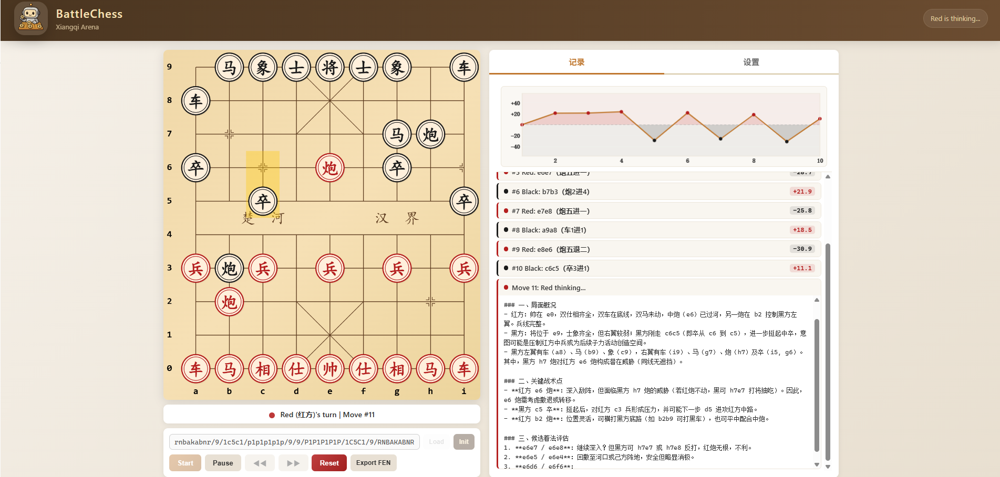

<p align="center">
  
</p>

# BattleChess - Xiangqi Arena

BattleChess 是一个本地运行的中国象棋 Arena，支持 `Human / Random / LLM / Pikafish` 任意两两对局。

前端使用原生 HTML / CSS / JavaScript 与 Canvas，后端使用 FastAPI。LLM 调用统一走 OpenAI Python SDK。
## 界面预览



## 功能概览

- 支持 `Human / Random / LLM / Pikafish` 四种玩家类型，可任意组合对战
- 支持 Pikafish 直接作为红方或黑方参与对局
- 支持为每一方单独指定不同的 Pikafish 可执行文件
- 支持评估用 Pikafish 与参与方 Pikafish 分开配置
- 支持预设模型和自定义 LLM 配置
- 支持从 `prompts/*.yaml` 加载 Prompt，并在 UI 中选择
- 支持自定义开局 FEN
- 支持暂停、恢复、历史回看，以及从回看位置继续对局
- 支持对局结束后自动保存详细日志
- 支持专业引擎对局评分

## 运行环境

- Python 3.10+

安装依赖：

```bash
pip install -r requirements.txt
```

启动服务：

```bash
python server.py
```

默认访问地址：

```text
http://127.0.0.1:8000
```

## config.yaml

先复制配置模板：

```bash
copy config.example.yaml config.yaml
```

示例：

```yaml
pikafish:
  eval_engine_path: .\pikafish\pikafish-bmi2.exe

models:
  - name: gpt-4o
    api_base: https://api.openai.com/v1
    api_key: sk-xxxxxxxxxxxxxxxx
    model: gpt-4o
    prompt_name: zh
    enable_thinking: true
    max_completion_tokens: 8192
```

## 项目结构

```text
XiangqiArena/
├── server.py
├── xiangqi.py
├── llm_client.py
├── pikafish_manager.py
├── prompt_registry.py
├── prompts/
│   ├── zh.yaml
│   └── en.yaml
├── pikafish/
│   ├── pikafish-bmi2.exe
│   ├── ...
│   └── pikafish.nnue
├── example/
│   └── example.png
├── config.example.yaml
├── config.yaml
├── requirements.txt
├── logs/
├── static/
│   ├── index.html
│   ├── style.css
│   ├── app.js
│   ├── board.js
│   └── logo.png
└── logo.png
```

## Acknowledgements

- [Pikafish](https://github.com/official-pikafish/Pikafish) - 强大的开源中国象棋引擎，本项目使用它作为参与方与评估引擎。
- [cchess](https://github.com/walker8088/cchess) - 中文着法展示规则参考了该项目中的中国象棋记谱实现思路。

> 大多数情况下，引擎速度：`vnni512 > bw512 > avx512 > avxvnni > bmi2 > avx2 > sse41-popcnt > ssse3`，请根据自己的 CPU 选择对应版本。

## License

MIT
